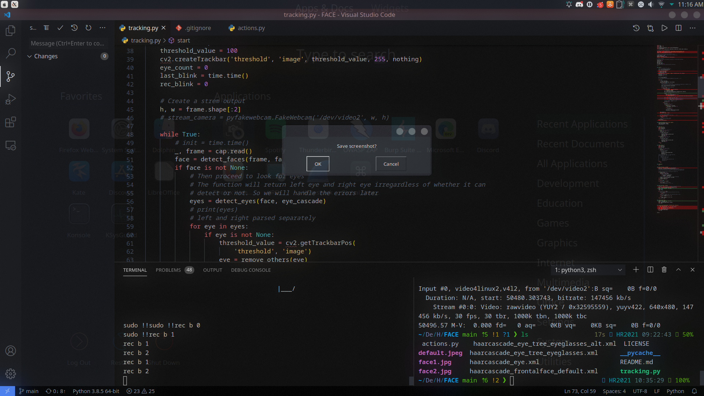
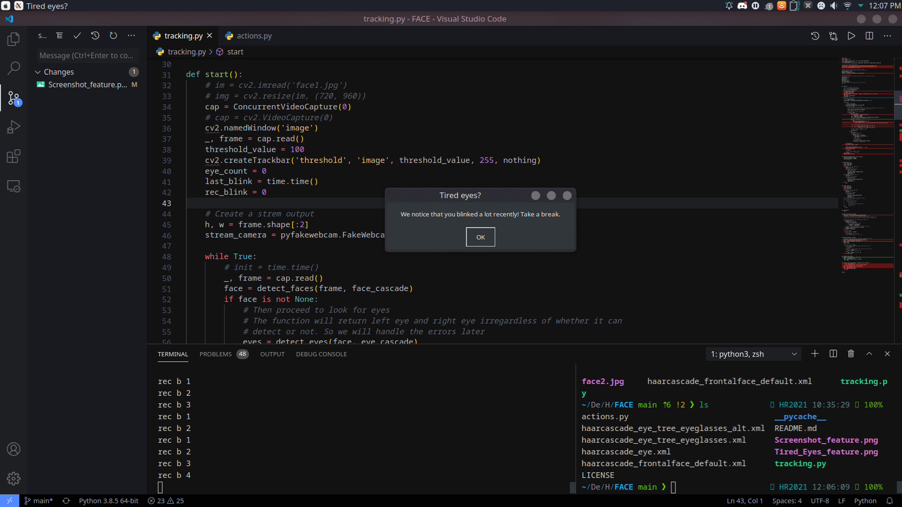

# EYE_Power

## About

Tired of moving your fingers and mouse too much when working from home or during video conferencing? Always scolded for only helping out through "eye-power"?

Fear not.

This simple tool would track your eye movement and perform simple tasks and shortcuts for you. Now you can truly utilise your eye-power to the maximum.

## Setting up

This project requires Python 3.8 and above and pip3. The project is tested on Linux since it depends on l4v2loopback which routes the webcam to a virtual video output, which is `/dev/video2` in this project. You can then pipe this output to any video conferencing software.

This project is tested on Kubuntu 20.04LTS; Kernel: 5.4.0-59 with secure boot.

Note that for devices with secure boot enabled, there is a need to enrol a MOK since v4l2loopback is editing the kernel directly.
Follow the installation instructions after the installation. You will need to reboot after installing v4l2loopback.

### Installation details

```
# Prerequisites. Not included is Python 3.8+ and Pip3
sudo apt update
sudo apt install scrot l4v2loopback-utils -y
pip3 install virtualenv

# Create a venv so that things remain clean
virtualenv venv
cd venv
source bin/activate
pip3 install -r requirements.txt

# This step might fail. You are required to enrol in your MOK if secure boot is enabled
sudo modprobe v4l2loopback devices=2

git clone https://github.com/wonyk/EYE_Power
cd EYE_Power/
python3 tracking.py

# To debug the output video stream too, use:
ffplay /dev/video2
```

### Customisation

All the available customisations are displayed in the `actions.py` file. There are a lot of things you could do:

- [Keyboard shortcuts / automation](https://pyautogui.readthedocs.io/en/latest/keyboard.html)
- [Mouse controls](https://pyautogui.readthedocs.io/en/latest/mouse.html)
- [Screenshots](https://pyautogui.readthedocs.io/en/latest/screenshot.html)
- [Alerts](https://pyautogui.readthedocs.io/en/latest/msgbox.html)
- [Commands](https://docs.python.org/3/library/subprocess.html#module-subprocess) using the Subprocess module
- Other python scripts and functions and many more...

## Screenshots

### Screenshot by blinking 3 times



### Alert when you blink multiple times



## Acknowledgements

I would like to thank all the tutorials online which had guided me through this journey.

As starters, I am thankful to [OpenCV](https://opencv-python-tutroals.readthedocs.io/en/latest/py_tutorials/py_objdetect/py_face_detection/py_face_detection.html) for their wonderful documentation to get me rolling. The eye and face detection dataset on their [Github](https://github.com/opencv/opencv/tree/master/data/haarcascades) page are also wonderful. Kudos to Haarcascades!

Next, I would like to thank these great authors whose code guided me through the development of EYE_Power, chiefly [Carlos Andrés Álvarez](https://medium.com/@candres.alv/image-filters-for-zoom-with-python-and-opencv-c279fb6cccbf) and [Stepan Filonov](https://medium.com/@stepanfilonov/tracking-your-eyes-with-python-3952e66194a6). Both projects had greaty influenced me and allowed me to grasp the tough topics quickly!

Lastly, I am grateful for the sponsors of Hack&Roll 2021 for making the environment so fun and enjoyable. One of their promotional video had inspired me to create this project.

## Licence

This project is licenced under [MIT License](LICENSE).
