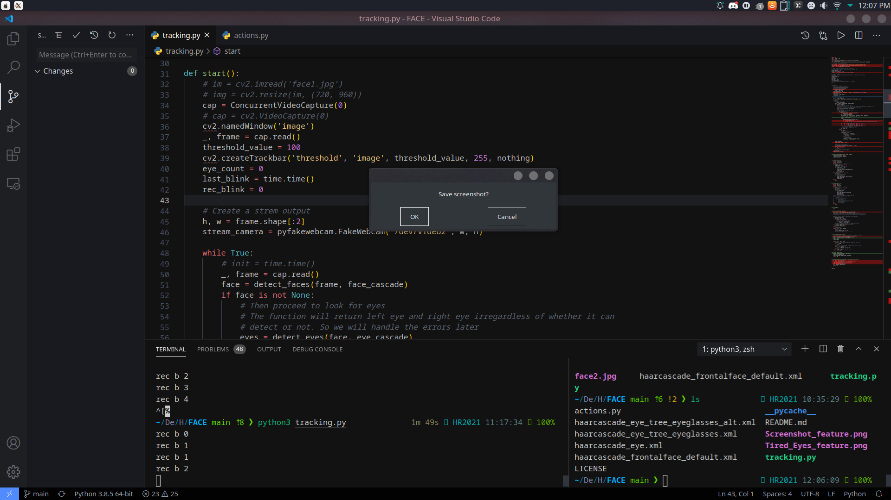

# EYE_Power

## About

Tired of moving your fingers and mouse too much when working from home or during video conferencing? Always scolded for only helping out through "eye-power"? Fear not.

This simple tool would track your eye movement and perform simple tasks and shortcuts for you. Now you can truly utilise your eye-power to the maximum.

## Screenshots

### Screenshot by blinking 3 times

### Alert when you blink multiple times

## Acknowledgements

I would like to thank all the tutorials online which had guided me through this journey.

## Licence

This project is licenced under MIT Licence.
